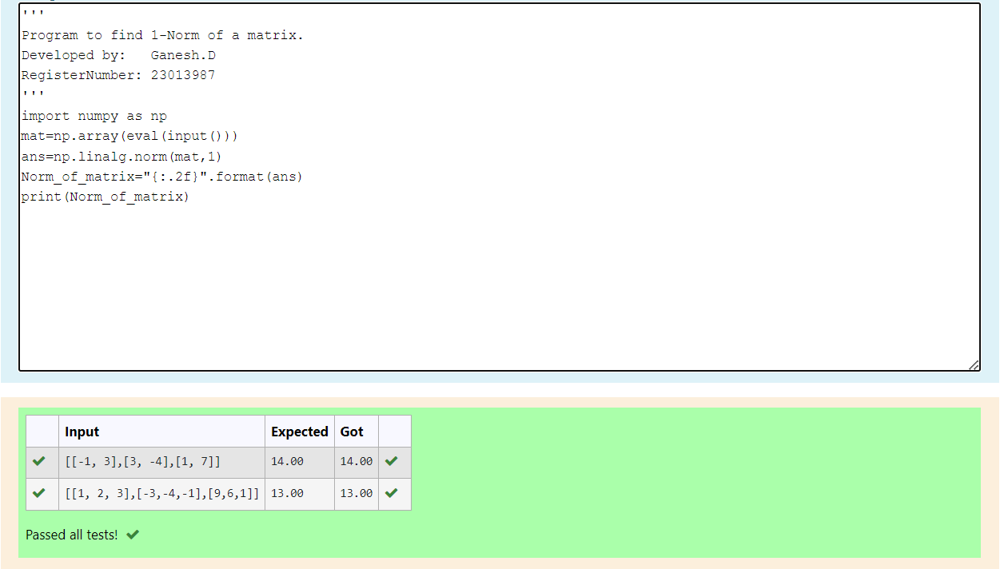
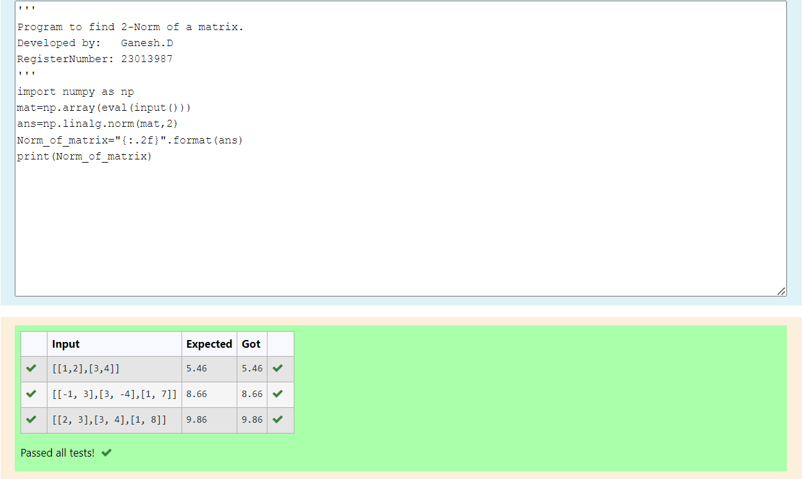

# Norm of a matrix
## Aim
To write a program to find the 1-norm, 2-norm and infinity norm of the matrix and display the result in two decimal places.
## Equipment’s required:
1.	Hardware – PCs
2.	Anaconda – Python 3.7 Installation / Moodle-Code Runner
## Algorithm:
	1. Get the input matrix using np.array()   
    2. Find the 2-norm of the matrix using np.linalg.norm()
	3. Print the norm of the matrix in two decimal places.

## 1-Norm of a matrix:
# Step 1:
Import the numpy library with the alias np
# Step 2: 
Use the eval() function to evaluate the input and convert it into a NumPy array
# Step 3:
Use the np.linalg.norm() function to calculate the L1 norm of the matrix
# Step 4:
Format the result to two decimal places using the "{:.2f}" format specifier
# Step 5: 
Print the result  
# Step 6:
End program.

## 2-Norm of a matrix:
# Step 1: 
Import the numpy library with the alias np
# Step 2: 
Use the eval() function to evaluate the input and convert it into a NumPy array
# Step 3: 
Use the np.linalg.norm() function to calculate the L2 norm of the matrix
# Step 4:
Format the result to two decimal places using the "{:.2f}" format specifier
# Step 5: 
Print the result
# Step 6:
End program.

## Infinity of a matrix:
# Step 1: 
Import the numpy library with the alias np
# Step 2: 
Use the eval() function to evaluate the input and convert it into a NumPy array
# Step 3: 
Use the np.linalg.norm() function to calculate the infinity norm of the matrix
# Step 4: 
Format the result to two decimal places using the "{:.2f}" format specifier
# Step 5: 
Print the result
# Step 6:
End program.

## Program:
```
# 1-Norm of a Matrix
'''
Program to find 1-Norm of a matrix.
Developed by:   Ganesh.D
RegisterNumber: 23013987
'''
import numpy as np
mat=np.array(eval(input()))
ans=np.linalg.norm(mat,1)
Norm_of_matrix="{:.2f}".format(ans)
print(Norm_of_matrix)


# 2-Norm of a Matrix
'''
Program to find 2-Norm of a matrix.
Developed by:   Ganesh.D
RegisterNumber: 23013987
'''
import numpy as np
mat=np.array(eval(input()))
ans=np.linalg.norm(mat,2)
Norm_of_matrix="{:.2f}".format(ans)
print(Norm_of_matrix)


# Infinity Norm of a Matrix
'''
Program to find the infinity norm of a matix.
Developed by:   Ganesh.D
RegisterNumber: 23013987
'''
import  numpy as np
mat=np.array(eval(input()))
ans=np.linalg.norm(mat,np.inf)
Norm_of_matrix="{:.2f}".format(ans)
print(Norm_of_matrix)

```
## Output:
### 1-Norm of a Matrix


### 2-Norm of a Matrix


### Infinity Norm of a Matrix


## Result
Thus the program for 1-norm, 2-norm and Infinity norm of a matrix are written and verified.
Then, the program is successfully executed.
